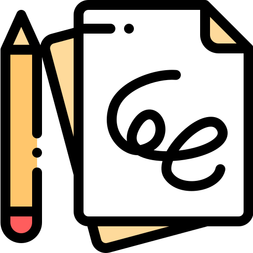
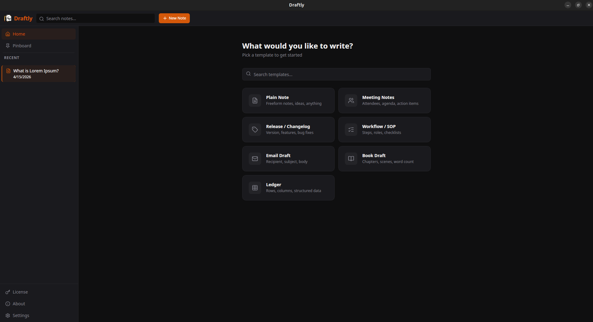
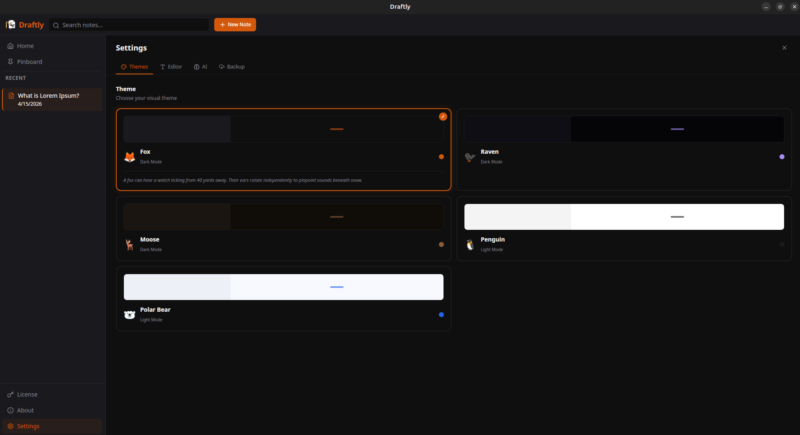

<a href="https://github.com/kashifkhan0771/draftly-releases" title="Draftly">
    
</a>

# Draftly

[](https://github.com/kashifkhan0771/draftly-releases/releases)
[](https://github.com/kashifkhan0771/draftly-releases/releases/latest)
[](https://go.dev)
[](https://wails.io)
[](#install)

**A local-first, privacy-native desktop note-taking app — with AI writing assistance built in.**

Your notes stay on your machine. No accounts, no cloud sync required, no data harvesting.  
Bring your own AI key to unlock intelligent rewriting and summarization — or use it entirely offline.

→ **[Download the latest release](https://github.com/kashifkhan0771/draftly-releases/releases/latest)**

---

## Screenshots





---

## What is Draftly?

Draftly is a cross-platform desktop application for writing and organizing notes. It's built for people who want a fast, focused writing environment that works offline and keeps their data private.

Notes are stored locally in a SQLite database — nothing is sent anywhere unless you explicitly choose to back up to Google Drive or use an AI feature.

---

## Features

### Note Templates

Start from a structured template instead of a blank page. Draftly ships with seven built-in types:

| Template | Purpose |
|---|---|
| **Plain Note** | Freeform notes, ideas, anything |
| **Meeting Notes** | Attendees, agenda, action items |
| **Release / Changelog** | Version, features, bug fixes |
| **Workflow / SOP** | Steps, roles, checklists |
| **Email Draft** | Recipient, subject, body |
| **Book Draft** | Chapters, scenes, word count |
| **Ledger** | Rows, columns, structured data |

### AI Writing Assistant

Select any text in the editor and use the AI toolbar to:

- **Rewrite** — rephrase your selection in a chosen tone: Professional, Casual, Formal, Friendly, Concise, or Creative
- **Summarize** — condense a block of text into a concise summary

Draftly supports four AI providers. Add your own API key in Settings → AI:

| Provider | Key format |
|---|---|
| Claude (Anthropic) | `sk-ant-...` |
| Gemini (Google) | `AIza...` |
| Grok (xAI) | `xai-...` |
| Groq | `gsk_...` |

If you configure more than one key, you can choose your preferred provider from the same settings panel. If no key is set, all AI features are simply hidden — Draftly works fully offline without them.

### Themes

Five hand-crafted themes, each with a unique color palette and a light or dark mode:

| Theme | Mode | Accent |
|---|---|---|
| 🦊 Fox | Dark | Orange |
| 🐦‍⬛ Raven | Dark | Purple |
| 🦌 Moose | Dark | Brown |
| 🐧 Penguin | Light | Black |
| 🐻‍❄️ Polar Bear | Light | Blue |

### Pinboard

Pin your most important notes to a dedicated Pinboard view for quick access.

### PDF Export

Export any note to a formatted PDF file via a native save dialog.

### Google Drive Backup

Optionally back up and restore all your notes to your own Google Drive account. No third-party server is involved — the connection goes directly from your machine to Google's OAuth2 endpoint.

- **Backup Now** — uploads a snapshot of all notes
- **Restore** — browse past snapshots and import notes from any of them

### Editor Controls

- Adjustable font size (12–24 px) via Settings → Editor
- Rich text editing powered by Tiptap (bold, italic, lists, headings, and more)
- Full-text search across all notes in the sidebar

### Auto-Update Notifications

Draftly checks GitHub for newer releases on launch and shows an in-app banner when one is available — no background updater process.

---

## Install

### Linux (Ubuntu / Debian / Mint)

Download the `.deb` package from the [releases page](https://github.com/kashifkhan0771/draftly-releases/releases/latest) and run:

```bash
sudo apt install ./draftly_VERSION_amd64.deb
```

If the app does not launch on start after install, run `draftly` from a terminal — it will start the app and surface any startup errors.

### macOS

Download the binary that matches your Mac:

| Architecture | File |
|---|---|
| Apple Silicon (M1/M2/M3/M4) | `draftly-macos-arm64` |
| Intel | `draftly-macos-amd64` |

Then make it executable and clear the quarantine flag:

```bash
chmod +x draftly-macos-*
xattr -dr com.apple.quarantine draftly-macos-*
./draftly-macos-*
```

### Windows

Download `draftly-windows-amd64.exe` and run the installer.

---

## Update

**Linux** — download the new `.deb` and run the install command again:

```bash
sudo apt install ./draftly_NEW_VERSION_amd64.deb
```

**macOS** — replace the existing binary with the new download.

**Windows** — run the new installer; it replaces the previous version automatically.

---

## Licensing

Draftly includes a free 3-day trial. After the trial period, a one-time license key is required. You can activate your license from the **License** page inside the app.

---

## Privacy

- All notes are stored locally in a SQLite database on your machine.
- AI features only send the specific text you select to the provider you configure, using your own API key.
- Google Drive backup is opt-in and uses your own Google account via OAuth2.
- No telemetry, no analytics, no account required.

---

Draftly is proprietary software. © 2026 Kashif Khan. All rights reserved.
